# Generate Brick Breaker

<p align="center">
  <a href="https://brickbreaker-live.netlify.app" target="_blank">
    
  </a>
  <a href="https://github.com/marketplace/actions/generate-brick-breaker">
    
  </a>
  <a href="https://github.com/MakdumIbrohim/generate-brick-breaker/actions">
    
  </a>
  <a href="https://github.com/MakdumIbrohim/generate-brick-breaker/stargazers">
    
  </a>
  <a href="https://github.com/MakdumIbrohim/generate-brick-breaker/blob/main/LICENSE">
    
  </a>
</p>

<p align="center">
  
</p>

Turn your GitHub contribution graph into an automated retro Brick Breaker game animation (SVG or GIF) for your profile README.

[English](#english) • [Bahasa Indonesia](#bahasa-indonesia)

---

## English

### Customization Options

#### Ball Skin Options (`ball_skin`)
| Option | Preview |
| :---: | :---: |
| `classic` (default) |  |
| `fire` |  |
| `ice` |  |
| `lightning` |  |
| `poison` |  |

#### Paddle Skin Options (`paddle_skin`)
| Option | Preview |
| :---: | :---: |
| `classic` (default) | Primary theme color |
| `laser` |  |
| `retro` |  |
| `mecha` |  |
| `cyber` |  |

#### Board Theme Options (`theme`)
| Option | Preview |
| :---: | :---: |
| `classic` (default) |  |
| `sky` |  |
| `sky-night` |  |
| `synthwave` |  |
| `matrix` |  |
| `sakura` |  |

---

### Live Web Studio

Customize skins, test themes, and download your generated game SVG/GIF online without any installation:  
[https://brickbreaker-live.netlify.app](https://brickbreaker-live.netlify.app)

---

### Installation & Usage

#### 1. GitHub Profile Integration (Automated)

1. In your GitHub profile repository (`username/username`), create `.github/workflows/brick-breaker.yml`:

```yaml
name: Generate Brick Breaker

on:
  schedule:
    # Runs automatically every hour to sync new commits
    - cron: "0 * * * *"
  push:
    branches:
      - main
  workflow_dispatch:

jobs:
  build:
    runs-on: ubuntu-latest
    permissions:
      contents: write
    steps:
      - uses: actions/checkout@v4

      - uses: MakdumIbrohim/generate-brick-breaker@main
        with:
          github_token: ${{ secrets.GITHUB_TOKEN }}
          github_user: ${{ github.repository_owner }}

          # Options: game.svg (recommended) or game.gif
          output_path: game.svg

          # Options: classic | fire | ice | lightning | poison
          ball_skin: classic

          # Options: classic | sky | sky-night | synthwave | matrix | sakura
          theme: classic

          # Options: classic | laser | retro | mecha | cyber
          paddle_skin: classic

      - name: Commit and Push
        run: |
          git config user.name "github-actions[bot]"
          git config user.email "github-actions[bot]@users.noreply.github.com"
          git add -A
          git diff --staged --quiet || git commit -m "chore: update brick breaker assets"
          git pull --rebase --autostash origin main || true
          git push origin main
```

2. Enable workflow permissions: Repo **Settings** > **Actions** > **General** > **Workflow permissions** > select **Read and write permissions** > **Save**.

3. Add image to your profile `README.md` (use `.svg` or `.gif` matching your `output_path`):
```markdown
<p align="center">
  
</p>
```

> **Note on Image Caching:** GitHub caches profile images through its Camo CDN. If you update settings and the animation does not change immediately, do a hard refresh (`Ctrl + F5` or `Cmd + Shift + R`), open your profile in an Incognito window, or allow 5–15 minutes for the CDN cache to clear.

#### 2. Local Usage

**Using Python:**
```bash
git clone https://github.com/MakdumIbrohim/generate-brick-breaker.git
cd generate-brick-breaker
pip install pillow

# Show help and available options
python generate.py --help
```

Examples:
```bash
# Flexible flag-based syntax
python generate.py YourGithubUsername --skin fire --theme sky --paddle mecha

# Or classic positional syntax
python generate.py YourGithubUsername game.svg fire classic laser
```

**Using Docker (Without installing Python):**
```bash
# Run with Docker Compose (outputs to current folder)
docker compose up

# Or run directly with Docker
docker build -t generate-brick-breaker .
docker run --rm -v $(pwd):/output generate-brick-breaker YourGithubUsername /output/game.svg
```

---

## Bahasa Indonesia

### Pilihan Kustomisasi

#### Pilihan Skin Bola (`ball_skin`)
| Opsi | Preview |
| :---: | :---: |
| `classic` (default) |  |
| `fire` |  |
| `ice` |  |
| `lightning` |  |
| `poison` |  |

#### Pilihan Skin Paddle (`paddle_skin`)
| Opsi | Preview |
| :---: | :---: |
| `classic` (default) | Warna primer tema aktif |
| `laser` |  |
| `retro` |  |
| `mecha` |  |
| `cyber` |  |

#### Pilihan Tema Papan (`theme`)
| Opsi | Preview |
| :---: | :---: |
| `classic` (default) |  |
| `sky` |  |
| `sky-night` |  |
| `synthwave` |  |
| `matrix` |  |
| `sakura` |  |

---

### Studio Web Interaktif (Live Demo Online)

Kustomisasi skin, uji tema, dan unduh aset game SVG/GIF langsung di browser tanpa perlu instalasi apa pun:  
[https://brickbreaker-live.netlify.app](https://brickbreaker-live.netlify.app)

---

### Panduan Instalasi & Penggunaan

#### 1. Pasang di Profil GitHub (Otomatis)

1. Di repo profil GitHub Anda (`username/username`), buat file `.github/workflows/brick-breaker.yml`:

```yaml
name: Generate Brick Breaker

on:
  schedule:
    # Berjalan otomatis setiap jam untuk menyinkronkan commit baru
    - cron: "0 * * * *"
  push:
    branches:
      - main
  workflow_dispatch:

jobs:
  build:
    runs-on: ubuntu-latest
    permissions:
      contents: write
    steps:
      - uses: actions/checkout@v4

      - uses: MakdumIbrohim/generate-brick-breaker@main
        with:
          github_token: ${{ secrets.GITHUB_TOKEN }}
          github_user: ${{ github.repository_owner }}

          # Opsi: game.svg (disarankan) atau game.gif
          output_path: game.svg

          # Opsi: classic | fire | ice | lightning | poison
          ball_skin: classic

          # Opsi: classic | sky | sky-night | synthwave | matrix | sakura
          theme: classic

          # Opsi: classic | laser | retro | mecha | cyber
          paddle_skin: classic

      - name: Commit and Push
        run: |
          git config user.name "github-actions[bot]"
          git config user.email "github-actions[bot]@users.noreply.github.com"
          git add -A
          git diff --staged --quiet || git commit -m "chore: update brick breaker assets"
          git pull --rebase --autostash origin main || true
          git push origin main
```

2. Beri izin write: buka repo **Settings** > **Actions** > **General** > **Workflow permissions** > pilih **Read and write permissions** > **Save**.

3. Tampilkan di `README.md` profil Anda (sesuaikan ekstensi `.svg` atau `.gif` dengan `output_path` Anda):
```markdown
<p align="center">
  
</p>
```

> **Catatan Cache Gambar:** GitHub menyimpan cache gambar profil melalui server Camo CDN. Jika Anda baru saja mengubah pengaturan tema/skin dan animasinya belum langsung berubah di profil, lakukan *hard refresh* (`Ctrl + F5` atau `Cmd + Shift + R`), buka lewat tab *Incognito*, atau tunggu 5–15 menit hingga cache CDN GitHub terperbarui otomatis.

#### 2. Penggunaan di Lokal

**Menggunakan Python:**
```bash
git clone https://github.com/MakdumIbrohim/generate-brick-breaker.git
cd generate-brick-breaker
pip install pillow

# Tampilkan menu bantuan dan opsi yang tersedia
python generate.py --help
```

Contoh pemakaian:
```bash
# Menggunakan flags modern yang fleksibel
python generate.py YourGithubUsername --skin fire --theme sky --paddle mecha

# Atau sintaks posisi klasik
python generate.py YourGithubUsername game.svg fire classic laser
```
